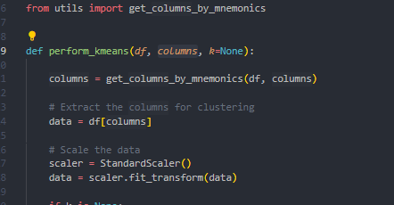

### How to add a feature

This is a step-by-step guide on how to add a clustering feature to your project:

1. Ensure that the `cluster` module is available in the `src` directory.

2. Create a new file named `clustering_feature.py` in the `feature_registry` module.

3. In `clustering_feature.py`, define a new class `ClusteringFeature` that inherits from the base class `Feature`.

4. Review the `cluster` module to identify any additional attributes it requires beyond those provided by the base class `Feature`.

   - 
   - Upon review, it's determined that the module requires an attribute `columns` (which is a list) and `k` (which can be an integer or `None`). These attributes can be stored in the `parameters` dictionary. The resulting `silhouette_score` will also be stored in `parameters`.

5. Implement the `ClusteringFeature` class, ensuring to include the additional attributes identified in the previous step.

6. Register the new feature in the `feature_registry.py` file.

7. In `app.py`, invoke the new feature:
   - The DataFrame resulting from the clustering operation should overwrite the existing file in the `clean_folder` of the `temp_folder`. This allows the clustered DataFrame to be used in subsequent steps.
